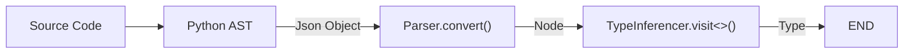
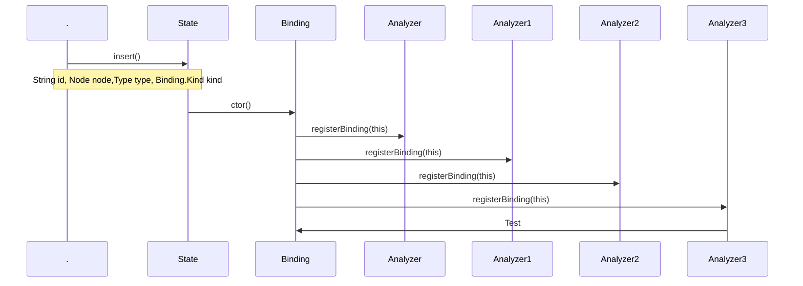
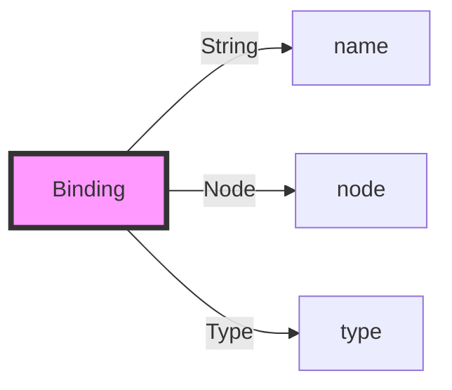
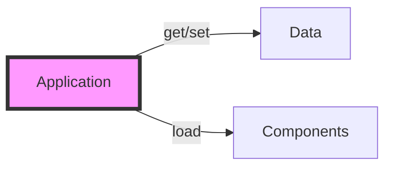
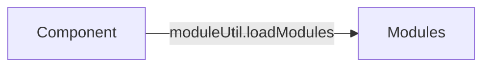

### 数据处理流程



### State 和 Binding





pomelo.components : ComponentConstructor[] app.components :
Map<string,Component>

all[monitor] master[master] !master[proxy, remote?, backendSession, channel,
server] frontend[connection, connector, session, pushScheduler]

proxy : rpc client remote : rpc server

# Application & pomelo

* 每个 pomelo 进程都是一个 Application 的实例
* Application 本身只是一个容器
  * 作为数据容器：最基本的功能是通过 get/set 两个函数存取任意数据
  * 作为功能容器：通过 load 函数可以加入任意多的 Component



* pomelo 只是系统的入口和一些全局数据的保存地点
  * 通过 pomelo.createApp() 得到 Application 的唯一实例
  * pomelo.components 里面有所有系统级的 Component 的工厂函数，都可以通过
    Application.load 函数载入到 Application 中
  * pomelo.filters 里面有所有系统提供的请求过滤器
  * pomelo.rpcFilters 里面有所有系统提供的 rpc 请求过滤器
  * pomelo.connectors 里面有所有系统提供的网络连接器
  * pomelo.pushSchedulers 里面有所有系统提供的计划任务处理器

## pomelo 进程按照功能的分类 ——serverType


* **`app/servers/${serverType}`**：包含一种 serverType 的全部代码，比如上图就
  有`chat`、`connector`、`gate`这三种 serverType
* **`app/servers/${serverType}/handler/`**：响应 client 请求的代码
* **`app/servers/${serverType}/remote/`**：是响应 RPC 请求的代码
* 除了 master，每个 pomelo 进程<span style="color:red;">是且只能</span>是一种
  serverType
* **`app/config/servers.json`** 控制所有 pomelo 进程的启动：

```json
{
  "development": { //env=development的时候，启动一个connector，两个chat，一个gate
    "connector": [
      { "id": "connector-server-1", "host": "127.0.0.1", "port": 4050, "clientPort": 3050, "frontend": true }
    ],
    "chat": [
      { "id": "chat-server-1", "host": "127.0.0.1", "port": 6050 },
      { "id": "chat-server-2", "host": "127.0.0.1", "port": 6060 }
    ],
    "gate": [
      { "id": "gate-server-1", "host": "127.0.0.1", "clientPort": 3014, "frontend": true }
    ]
  },
  "production": { //env=production的时候，启动一个gate
    "gate": [
      { "id": "gate-server-1", "host": "127.0.0.1", "clientPort": 3014, "frontend": true }
    ]
  }
  //上面的env可以通过命令行参数传递：node app env=development
}
```

* serverType 进程和`app/server/${serverType}/handler|remote`的关系：


### Client 请求和目结构的映射


### RPC 请求和目录结构的映射


## pomelo 进程按照网络角色的分类 ——master,frontend,backend

* **Master** 负责启动除了 master 类之外的所有 pomelo 进程，master 类的由人类启动
  （node app ...)
* **Frontend** Client 能直接连接的 pomelo 进程
* **Backend** Client 不能直接与之连接的 pomelo 进程不同种类的

Application 缺省载入的 Component 逻辑在`pomelo/lib/applications:loadDefaultComponents()`中实现，
  载入情况如下表：

| Component      | Master | Frontend | Backend |
| -------------- | ------ | -------- | ------- |
| master         | O      |          |
| proxy          |        | O        | O       |
| remote         |        | port     | port    |
| connection     |        | O        |
| connector      |        | O        |
| session        |        | O        |
| pushScheduler  |        | O        |
| backendSession |        | O        | O       |
| channel        |        | O        | O       |
| server         |        | O        | O       |
| monitor        | O      | O        | O       |

其中 port 表示如果 servers.json 文件中这个 Application 配置了 port 参数，就载入
，否则不载入。

* **三种 Application 的网络拓扑结构如下：**
  

## Component 的简介

Component 是组成 Application 的基本部件，为了更好的代码重用，pomelo 把 Component
之间一些共用的功能提取出来，这些功能模块，在 pomelo 中叫做 module，比
如`pomelo/lib/modules/`下的几个系统提供 module。Component 除了实现自己特别的功能
之外，也可以载入这些 module 来扩展自己的功能。



系统提供了如下几个 Component:

* **master**\
  master 这个 Component 的功能，就是根据配置文件`app/config/servers.json`启动所有
  的 Applications。
* **server** server 这个 Component 的功能，就是负责载
  入`app/servers/${serverType}/handler/`下的 handlers，提供对 client 请求的响应
  。
* **remote** remote 这个 Component 的功能，就是负责载
  入`app/servers/${serverTYpe}/remote/`下的 remote handlers，提供对 rpc 请求的响
  应。
* **connector** connector 这个 Component 的功能，就是为 Application 提供网络连接
  ，系统提供了几种 connector 都在`pomelo/lib/connectors/`下，可以通过配置指定使
  用其中的一个。
* **connection** connection 这个 Component 的功能，就是记录  所有连接了
  Application 的 client 的信息，方便统计和其它相关需要。
* **channel** channel 这个 Component 的功能，就是提供 Application 之间的广播，组
  播消息的功能 。
* **proxy** proxy 这个 Component 的功能，是为 Application 生成可以进行 rpc 调用
  的代理对象，比如进行`app.rpc.chat.chatRemote.xxx()`这样的调用，这个 Component
  启动的时候会扫描所有 app.rpc 这个对象，就是 proxy 生成的。

### master组件怎样启动所有serverType进程
* master组件代码位置
`lib/components/master.js`是入口，`lib/master/master.js`是主要实现代码

