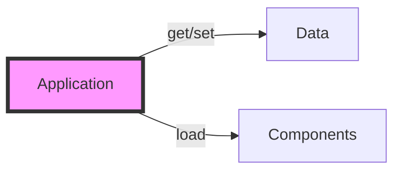
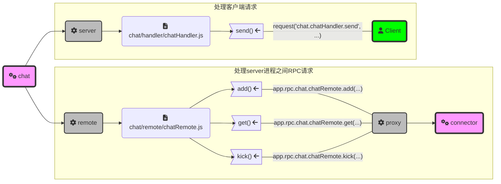

# nodejs & npm

## npm 的使用技巧

NOTE:install 命令和 add 命令是一样的，add 是 install 的别名

* 搜索
  * `npm search <keyword>`根据 keyword 搜索所有有关的包并输出信息
  * `npm info <pkgname>`查看 pkgname 指定的包的信息
* 安装包
  * `npm install`安装当前目录下 pakcage.json 中指定的依赖包
  * `npm install -d`安装当前目录下 pakcage.json 中指定的依赖包  和开发依赖包
  * `npm install <pkgname>`安装指定包
  * `npm install -g <pkgname>`安装指定包为全局包
  * `npm install github_user_name/pkgname` 安装 github 上的包
* 开发 nodejs 包

  * `npm init`启动一个引导过程，引导用户输入包的参数，然后用这些参数初始化当前  目录  作为一个包的根目录( 基本上就是在当前目录下生成一个 package.json 文件)
  * `npm add <pkgname>`本目录安装包，并把包添加为依赖包
  * `npm add github_user_name/pkgname` 本目录安装 github 上的包，并把包添加为依赖包
  * `npm add --save-dev <pkgname>`本目录安装包，并把包添加为开发依赖包

## 方便好用的 npx

安装完 nodejs 后，我们会拥有 npm 这个工具，其实同时还有个好用的工具也被安装了，那就是 npx。
npx 主要的功能，是方便执行 npm 安装的各种包里面的命令，比如 pomelo 命令就可以这么执行： `npx pomelo --help`

* 不需要 PATH 环境变量也能找到全局包和当前目录所有包里面提供的命令
* 如果当前目录和全局都没有找到命令，npx 会自动  临时  安装命令所在的包，然后执行命令。
  比如我不想安装 pomelo 但是又想用一下 pomelo 命令生成一个 app，你就直接:  
  `npx pomelo init`就行了
## javascript的方便功能
* **模板字符串**：对字符串中的表达式和变量求值并把结果放入字符串
```javascript
let x = 100;
console.log(`1+2+x = ${1+2+x}`);
//stdout: 1+2+x = 103
```
* **util.inspect(obj)**:把obj的结构变成容易理解的字符串
```javascript
console.log(util.inspect(util));
```
* **console.trace()**:打印当前callstack
```javascript
function trytrace(){
  console.trace('hello');
}
trytrace();

//stdout:
Trace: hello
    at trytrace (repl:1:30)
    at repl:1:1
    at ContextifyScript.Script.runInThisContext (vm.js:50:33)
    at REPLServer.defaultEval (repl.js:240:29)
    at bound (domain.js:301:14)
    at REPLServer.runBound [as eval] (domain.js:314:12)
    at REPLServer.onLine (repl.js:441:10)
    at emitOne (events.js:121:20)
    at REPLServer.emit (events.js:211:7)
    at REPLServer.Interface._onLine (readline.js:282:10)
```

## javascript 的坑

* **尽量用 let 声明变量， var 的 scope 是整个 block**

  ```javascript
  function test() {
    if (true) {
      var _var = "var";
      let _let = "let";
    }
    assert(_var === "var");
    //不能访问_let，因为不在_let的scope里面
  }
  ```

* **closure 中要正确引用 this，请用箭头函数而不是 function**

  ```javascript
  SomeClass.prototype.makeClosure = function() {
    return () => {
      //这里如果return function() {， 那么下面的this值是undefined
      console.log(this.constructor.name);
    };
  };
  ```

## async/await & Promise 处理异步

* **Promise** 用来包装一个执行异步操作的函数，并提供返回(resolve)和错误(reject)两个 callback 函数给该函数，如下例：

  ```javascript
  let timer = new Promise((resolve, reject) => {
    console.log("start");
    setTimeout(() => {
      resolve("timeout"); //当1000ms时间到，返回'timeout'字符串作为Promise的结果
    }, 1000);
  });
  ```

  实际上，你如果在 nodejs 的 shell 中打入上面代码，会立刻看到'start'被打印出来，这表示 Promise 在生成后，就会立刻执行构造的时候传给它的那个函数，但是只有当 Promise 传递给用户函数的 resolve 或者 reject 两个 callback 中的一个被执行，这个 Promise 的生命周期才会结束。那么，我们怎么收到 1000ms 后传递给 resolve 的那个'timeout'串？这样就可以：

  ```javascript
  timer.then(val => {
    console.log(val); //val == 'timeout'
  });
  ```

  很容易理解，当 resolve 被执行的时候，Promise 会把 resolve 的结果传递给 then 函数的那个用户函数。
   那么出错的处理流程怎样呢，如下 ：

  ```javascript
  let errorDemo = new Promise((resolve, reject) => {
    console.log("start");
    reject("error msg");
  });
  errorDemo.catch(err => {
    console.log(err); //err === 'error msg'
  });
  ```

  综合以上，resolve(msg)的 msg 由传递给 then 的 callback 得到 ，而 reject(err)的 err 由传递给 catch 的 callback 得到。Promise 的作用，就是提供一个异步操作的环境，把异步操作和等待操作结果的代码用 callback 的方式有机的整合在一起。

* **async/await**
  虽然 Promise 可以解决异步的问题，但是代码到处是回调，不是很好理解，所以在新的 ECMAScript 提案里面， 出台了 async/await 方案，这个方案是建立在 Promise 的基础上的，所以理解 Promise 的工作原理对于理解 async/await 是很有用的。

  * **async**
    async 是用来描述函数的，一般用法是这样：
    ```javascript
    async function asyncFunc() {}
    ```

    一个 async 函数只能返回 Promise，不能是其它的东西，事实上，async 是个语法糖，不论你在里面 return 的是什么(或者什么都没 return)，vm 都会帮你变成 Promise:

    ```javascript
    async function asyncTest() {
      return "hello";
    }
    let val = asyncTest();
    assert(val instanceof Promise);
    val.then(msg => {
      console.log(msg); //msg === "hello"
    });
    ```

  * **await**
    await 关键字<span style="color:red;">只能在 async 函数中使用</span>，并且<span style="color:red;">只用在调用一个 async 的函数的时候</span>，语义是等待 async 函数返回的 Promise 被 resolve 或 reject 后，才执行 await 后面的代码：

    ```javascript
    //这里已经return的是Promise了，就不要加async了
    function sleep(ms) {
      return new Promise((resolve, reject) => {
        setTimeout(() => {
          resolve(`sleep ${ms}ms finished.`);
        }, ms);
      });
    }

    //函数里面用到了await，所以必须加async
    async function play() {
      console.log("start");
      let ret = await sleep(2000); //ret === 'sleep 2000ms finished.'
      console.log(ret);
    }

    play();
    ```

    上面的程序执行的结果是，先输出'start'，然后 2 秒后输出'sleep 2000ms finished.'。
# TypeScript
TypeScript是JavaScript的超集，也就是说，所有的JavaScript代码，都是合法的TypeScript代码（当然，不能打开TypeScript的一些严格检查类型的开关)。用TypeScript就是想使用它的类型系统来避免动态类型语言写大型软件的时候各种坑。
TypeScript的基础部分大家可以参考 http://tslang.cn/docs/home.html 下的中文资料学习，我这里说一些自己实际使用中的心得：

## 两种ts文件
TypeScript的代码文件分两种：
* **.ts**
TypeScript代码文件 ，就是带类型的JavaScript代码，<spawn style="color:red">需要编译成js代码后才能执行</spawn>。
* **.d.ts**
纯描述类型的文件，不包含逻辑代码（类似c/c++的头文件），当然也<spawn style="color:red">不会被编译成js文件</span>

## 使用已有的JavaScript库
在TS里面使用已有的JS库会面临两种可能：
* **可以用`npm install @types/xxlib`找到现成的类型包**
简单，那就npm install然后在TS里用就是了
* **上述方法找不到现存的类型包**
自己写.d.ts文件 

隐藏的第三种可能，就是你写个定义文件，上github发个pull request然后祈祷被接受。。。之后，就可以`npm install @types/xxlib`了。
## .d.ts文件入门
.d.ts文件是用来给已有的js模块增加类型定义用的，所以下面的内容都假定存在已有的js模块，不再每次都说明了。
* 全局申明，比如已有的模块给String类添加了方法，可以这样在.d.ts文件里面申明：
  ```typescript
  declare global {//进入global
    interface String {//进入String
      theAdditionMethodForString():void;//申明新加的函数 
    }
  }
  ```
* 最常用的，定义一个用`module.exports = ...` 导出内容的模块
对于这种模块，有两种方法给它写d.ts文件， 比如我有如下的`mylib.js`文件是可以通过`require('mylib')`载入的：
    ```javascript
    //old style class
    function OldClass(url) {
      this.url = url;
    }
    OldClass.prototype.geturl = function() {
      return this.url;
    }
    OldClass.staticName = 'staticName';

    //new style class
    class NewClass {
      constructor(data) {
        this.data = data;
      }
      init(arg) {
        return true;
      }
    }

    module.exports.OldClass = OldClass;
    module.exports.NewClass = NewClass;
    module.exports.CONST_NAME = 'myname';
    module.exports.someFunc = function() {
      return 'hello';
    }
    ```
  * **同目录下添加同名的mylib.d.ts文件**
    ```typescript
    export class OldClass {
      constructor(url:string);
      geturl():string;
      static staticName:string;
    }
    export class NewClass {
      constructor(data:any);
      init(arg:any):boolean;
    }
    export const CONST_NAME:string;
    export function someFunc():string;
    ```
  * **任意位置添加一个随便命名的比如 `xxx.d.ts`**
    ```typescript
    declare module "mylib" {
      export class OldClass {
        constructor(url:string);
        geturl():string;
        static staticName:string;
      }
      export class NewClass {
        constructor(data:any);
        init(arg:any):boolean;
      }
      export const CONST_NAME:string;
      export function someFunc():string;
    }
    ```
    然后在你需要使用`mylib`的ts文件的开头这样写：
    ```typescript
    /// <reference path="./path/to/xxx.d.ts" />
    import mylib = require('mylib');
    ```
## TypeScript中用class和interface的区别
假定我们在`mylib.d.ts`中有如下定义：
```typescript
declare module "mylib" {
  export interface OldClass {
    new(url:string):OldClass;
    geturl():string;
  }
  export class NewClass {
    constructor();
  }
}
```
这里`OldClass`和`NewClass`的区别就在于，`OldClass`只是一个纯类型，不能当作值来用，比如：
```typescript
let oldCls = mylib.OldClass; //Error!
let oldObj = new mylib.OldClass('http://xxx.com');//Error! 
let oldVar = {} as mylib.OldClass; //OK!

let newCls = mylib.NewClass; //OK!
let newObj = new mylib.NewClass(); //OK!
```


#  pomelo

* 每个 pomelo 进程都是一个 Application 的实例
* Application/app 本身只是一个容器
  * 作为数据容器：最基本的功能是通过 get/set 两个函数存取任意数据
  * 作为功能容器：通过 load 函数可以加入任意多的 Component



* pomelo 只是系统的入口和一些全局数据的保存地点
  * 通过 pomelo.createApp() 得到 Application 的唯一实例
  * pomelo.components 里面有所有系统级的 Component 的工厂函数，都可以通过
    Application.load 函数载入到 Application 中
  * pomelo.filters 里面有所有系统提供的请求过滤器
  * pomelo.rpcFilters 里面有所有系统提供的 rpc 请求过滤器
  * pomelo.connectors 里面有所有系统提供的网络连接器
  * pomelo.pushSchedulers 里面有所有系统提供的计划任务处理器

## pomelo 进程按照功能的分类 ——serverType


* **`app/servers/${serverType}`**：包含一种 serverType 的全部代码，比如上图就有`chat`、`connector`、`gate`这三种 serverType
* **`app/servers/${serverType}/handler/`**：响应 client 请求的代码
* **`app/servers/${serverType}/remote/`**：是响应 RPC 请求的代码
* 每个 pomelo 进程<span style="color:red;">是且只能</span>是一种 serverType
* **`app/config/servers.json`** 控制所有 pomelo 进程的启动：

  ```json
  {
    "development": {
      //env=development的时候，启动一个connector，两个chat，一个gate
      "connector": [
        {
          "id": "connector-server-1",
          "host": "127.0.0.1",
          "port": 4050,
          "clientPort": 3050,
          "frontend": true
        }
      ],
      "chat": [
        { "id": "chat-server-1", "host": "127.0.0.1", "port": 6050 },
        { "id": "chat-server-2", "host": "127.0.0.1", "port": 6060 }
      ],
      "gate": [
        {
          "id": "gate-server-1",
          "host": "127.0.0.1",
          "clientPort": 3014,
          "frontend": true
        }
      ]
    },
    "production": {
      //env=production的时候，启动一个gate
      "gate": [
        {
          "id": "gate-server-1",
          "host": "127.0.0.1",
          "clientPort": 3014,
          "frontend": true
        }
      ]
    }
    //上面的env可以通过命令行参数传递：node app env=development
  }
  ```

* serverType 进程和`app/server/${serverType}/handler|remote`的关系：



### Client 请求和目结构的映射


### RPC 请求和目录结构的映射


## pomelo 进程按照网络角色的分类 ——master,frontend,backend

* **Master** 负责启动除了 master 类之外的所有 pomelo 进程，master 类的由人类启动（node app ...)
* **Frontend** Client 能直接连接的 pomelo 进程
* **Backend** Client 不能直接与之连接的 pomelo 进程不同种类的

Application 缺省载入的 Component 逻辑在`pomelo/lib/applications:loadDefaultComponents()`中实现，载入情况如下表：

| Component      | Master | Frontend | Backend |
| -------------- | ------ | -------- | ------- |
| master         | O      |          |
| proxy          |        | O        | O       |
| remote         |        | port     | port    |
| connection     |        | O        |
| connector      |        | O        |
| session        |        | O        |
| pushScheduler  |        | O        |
| backendSession |        | O        | O       |
| channel        |        | O        | O       |
| server         |        | O        | O       |
| monitor        | O      | O        | O       |

其中 port 表示如果 servers.json 文件中这个 Application 配置了 port 参数，就载入，否则不载入。

* **三种 Application 的网络拓扑结构如下：**
  

## Component 的简介

Component 是组成 Application 的基本部件 系统提供了如下几个 Component:
* **master**\
  master 这个 Component 的功能，就是根据配置文件`app/config/servers.json`启动所有的 Applications。
* **server** server 这个 Component 的功能，就是负责载入`app/servers/${serverType}/handler/`下的 handlers，提供对 client 请求的响应。
* **remote** remote 这个 Component 的功能，就是负责载入`app/servers/${serverTYpe}/remote/`下的 remote handlers，提供对 rpc 请求的响应。
* **connector** connector 这个 Component 的功能，就是为 Application 提供网络连接，系统提供了几种 connector 都在`pomelo/lib/connectors/`下，可以通过配置指定使用其中的一个。
* **connection** connection 这个 Component 的功能，就是记录  所有连接了
  Application 的 client 的信息，方便统计和其它相关需要。
* **channel** channel 这个 Component 的功能，就是提供 Application 之间的广播，组播消息的功能 。
* **proxy** proxy 这个 Component 的功能，是为 Application 生成可以进行 rpc 调用的代理对象，比如进行`app.rpc.chat.chatRemote.xxx()`这样的调用，这个 Component
  启动的时候会扫描所有 app.rpc 这个对象，就是 proxy 生成的。

### master 组件怎样启动所有 serverType 进程

* **master 组件代码位置**
  `lib/components/master.js`是入口，`lib/master/master.js`是主要实现代码
* **master 启动 serverType 进程详细过程**
  * 从 app.start() -> master.start() -> starter.runServer()


  ```mermaid
  sequenceDiagram
    participant app as lib/application.js
    participant master as lib/master/master.js
    participant starter as lib/master/starter.js
    app->>master: start()
    master->>+starter: runServers(app)
    loop svr in servers.json
      starter->>+starter: run(app, svr)
    end
  ```
  * starter 启动进程的逻辑


  ```mermaid
  sequenceDiagram
    participant rs as runServers()
    participant r as run()
    participant local as localrun()
    participant ssh as sshrun()
    rs->rs: serverInfo = {type:"chat", id:"gate-1", host:"1.1.1.1"...}
    rs->>r: args=(app, serverInfo)
    alt utils.isLocal(serverInfo.host)
        r->>local:调用localrun启动本机进程  
    else !utils.isLocal(serverInfo.host)
        r->>ssh:调用sshrun启动其它机器进程
    end
  ```
###  客户端请求的路由
类似`chat.chatHandler.send`这样的请求路径，是怎样找到最终的执行函数的？下面的图给出答案：
  ```mermaid
  sequenceDiagram
    participant client as client
    participant connsvr as connector-server-1
    participant connector as components/connector.js
    participant server as server/server.js
    participant chat as chat-server-1
    client->>connsvr: chat.chatHandler.send
    connsvr->>connector: handleMessage()
    connector->>server: globalHandle()
    server->>server: parseRoute('chat.chatHandler.send')
    server->>server: route = {serverType:'chat', handler:'chatHandler', method:'send'}
    alt app.serverType == route.serverType
      server->>server: doHandle()
    else app.serverType != route.serverType
      server->>chat: app.sysrpc.chat.msgRemote.forwardMessage
      chat->>chat: msgRemote.js:forwardMessage
      chat->>server: handle()
      server->>server: doHandle()
    end
  ```

### Session
一个客户端的连接在pomelo中就是用一个Session来代表，Session中保存一个客户端的连接和其它服务器想要保存的客户端相关信息。 Session分两种:
* **FrontendSession**
在Frontend类型的服务器进程上的，就是FrontendSession，这是真正执行工作的Session。
* **BackendSession**
在Backend类型的服务器进程上的，就是BackendSession，它只是对应的FrontendSession在Backend服务器上的代理，对它的API的调用最后会通过RPC传递给Frontend服务器上对应的FrontendSession去执行动作。

Session上重要的操作有如下几个：
* **bind/unbind**
把Session和用户的uid绑定和解除绑定
* **set/get**
根据key保存/获得数据

FrontendSession上特有的操作：
* **send/sendBatch**
给绑定的用户发消息

BackendSession上特有的操作：
* **push/pushAll**
把用set接口保存的数据同步到对应的FrontendSession去，也就是把数据从Backend进程同步到Frontend进程去。