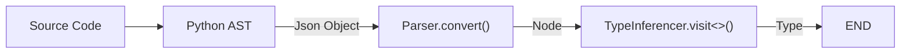
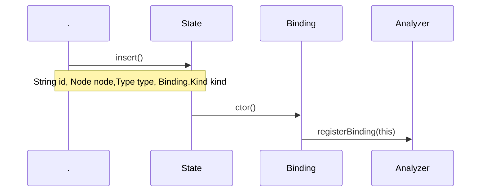
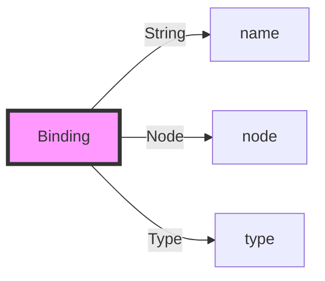
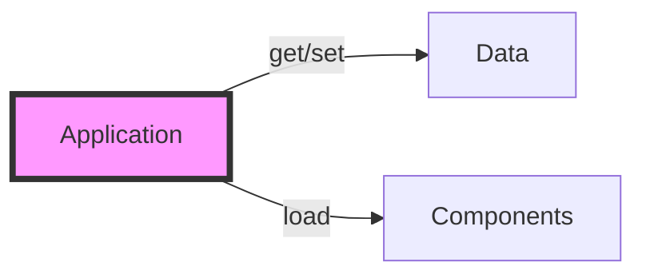
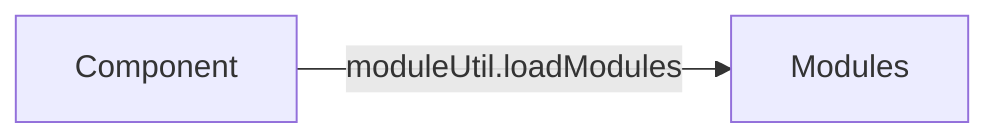

### 数据处理流程

### State和Binding



pomelo.components : ComponentConstructor[]
app.components : Map<string,Component>

all[monitor]
master[master]
!master[proxy, remote?, backendSession, channel, server]
frontend[connection, connector, session, pushScheduler]

proxy : rpc client
remote : rpc server

# Application & pomelo
* 每个pomelo进程都是一个Application的实例
* Application本身只是一个容器
  * 作为数据容器：最基本的功能是通过get/set两个函数存取任意数据
  * 作为功能容器：通过load函数可以加入任意多的Component

* pomelo只是系统的入口和一些全局数据的保存地点
  * 通过pomelo.createApp()得到Application的唯一实例
  * pomelo.components里面有所有系统级的Component的工厂函数，都可以通过Application.load函数载入到Application中
  * pomelo.filters里面有所有系统提供的请求过滤器
  * pomelo.rpcFilters里面有所有系统提供的rpc请求过滤器
  * pomelo.connectors里面有所有系统提供的网络连接器
  * pomelo.pushSchedulers里面有所有系统提供的计划任务处理器
## 不同类型的Application
根据载入Component的不同，Application可以分为三类：
* MASTER  
负责启动除了MASTER类之外的所有Application
* Frontend  
Client能直接连接的Application
* Backend  
Client不能直接与之连接的Application
## Component的简介
Component是组成Application的基本部件，为了更好的代码重用，pomelo把Component之间一些共用的功能提取出来，这些功能模块，在pomelo中叫做module，比如```pomelo/lib/modules/```下的几个系统提供module。Component除了实现自己特别的功能之外，也可以载入这些module来扩展自己的功能。

系统提供了如下几个Component:
* master  
master这个Component的功能，就是根据配置文件启动所有的Applications。

# 启动过程
