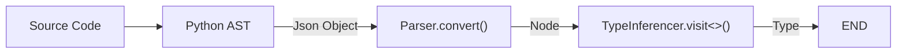
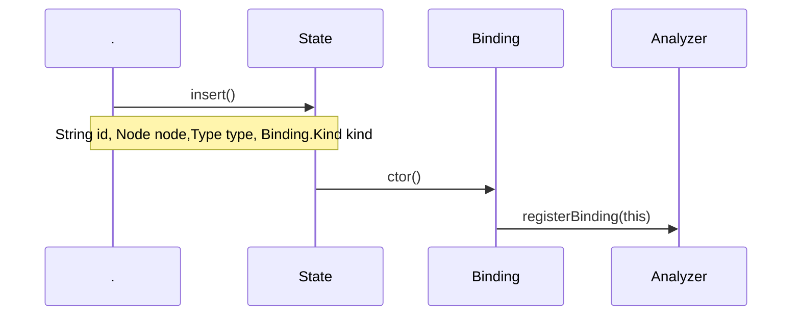
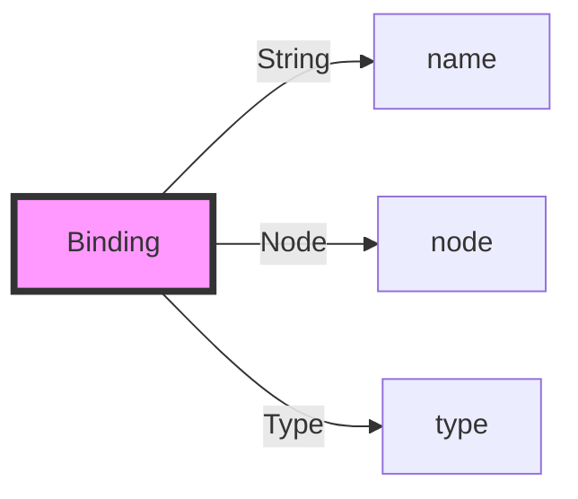
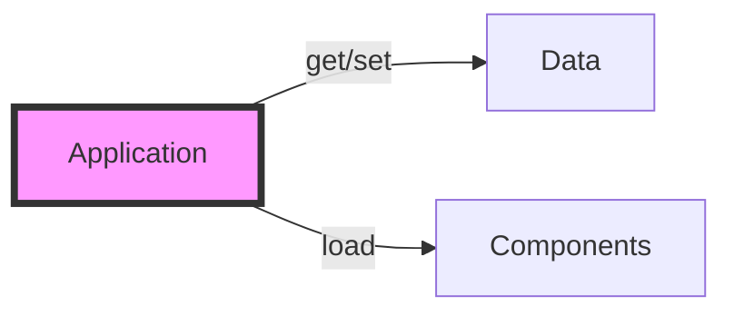
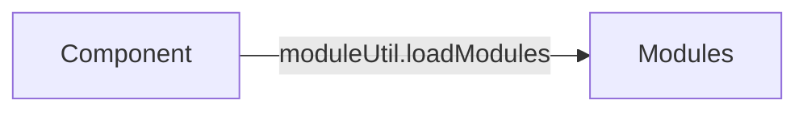

### 数据处理流程

### State 和 Binding

pomelo.components : ComponentConstructor[]
app.components : Map<string,Component>

all[monitor]
master[master]
!master[proxy, remote?, backendSession, channel, server]
frontend[connection, connector, session, pushScheduler]

proxy : rpc client
remote : rpc server

# Application & pomelo

* 每个 pomelo 进程都是一个 Application 的实例
* Application 本身只是一个容器
  * 作为数据容器：最基本的功能是通过 get/set 两个函数存取任意数据
  * 作为功能容器：通过 load 函数可以加入任意多的 Component

* pomelo 只是系统的入口和一些全局数据的保存地点
  * 通过 pomelo.createApp()得到 Application 的唯一实例
  * pomelo.components 里面有所有系统级的 Component 的工厂函数，都可以通过 Application.load 函数载入到 Application 中
  * pomelo.filters 里面有所有系统提供的请求过滤器
  * pomelo.rpcFilters 里面有所有系统提供的 rpc 请求过滤器
  * pomelo.connectors 里面有所有系统提供的网络连接器
  * pomelo.pushSchedulers 里面有所有系统提供的计划任务处理器

## 不同类型的 Application

根据载入 Component 的不同，Application 可以分为三类：

* **Master**
  负责启动除了 MASTER 类之外的所有 Application
* **Frontend**
  Client 能直接连接的 Application
* **Backend**
  Client 不能直接与之连接的 Applicationo
  不同种类的 Application 缺省载入的 Component 逻辑在`pomelo/lib/applications:loadDefaultComponents()`中实现，载入情况如下表：

| Component      | Master | Frontend | Backend |
| -------------- | ------ | -------- | ------- |
| master         | O      |          |
| proxy          |        | O        | O       |
| remote         |        | port     | port    |
| connection     |        | O        |
| connector      |        | O        |
| session        |        | O        |
| pushScheduler  |        | O        |
| backendSession |        | O        | O       |
| channel        |        | O        | O       |
| server         |        | O        | O       |
| monitor        | O      | O        | O       |

其中 port 表示如果 servers.json 文件中这个 Application 配置了 port 参数，就载入，否则不载入。

**到这里我们会发现，按照上面说的 Application 的种类，一共也没几个，算上 port 参数的有无，也就五种类型，那么是怎么能实现无数种不同的服务进程的呢？**

### Application 的 serverType 类型和`app/config/servers.json`

要回答上面的问题，就需要了解，每个 Application，还有个服务类型，叫 serverType。前面的类型决定  了 Application 会载入什么 Component，而 serverType 决定了 Application 会载入哪些服务逻辑(实际上，这是由 server 这个 Component 的逻辑驱动的)，决定 Application 的 serverType 的地方，就是`app/config/servers.json`。

#### app/config/servers.json 的说明 TODO

## Component 的简介

Component 是组成 Application 的基本部件，为了更好的代码重用，pomelo 把 Component 之间一些共用的功能提取出来，这些功能模块，在 pomelo 中叫做 module，比如`pomelo/lib/modules/`下的几个系统提供 module。Component 除了实现自己特别的功能之外，也可以载入这些 module 来扩展自己的功能。

系统提供了如下几个 Component:

* **master**  
  master 这个 Component 的功能，就是根据配置文件`app/config/servers.json`启动所有的 Applications。
* **server**
  server 这个Component的功能，就是负责载入`app/servers/${serverType}/handler/`下的handlers，提供对client请求的响应。
* **remote**
  remote这个Component的功能，就是负责载入`app/servers/${serverTYpe}/remote/`下的remote handlers，提供对rpc请求的响应。
* **connector**
  connector这个Component的功能，就是为Application提供网络连接，系统提供了几种connector都在`pomelo/lib/connectors/`下，可以通过配置指定使用其中的一个。
* **connection**
  connection这个Component的功能，就是记录所有连接了Application的client的信息，方便统计和其它相关需要。
* **channel**
  channel这个Component的功能，就是提供Application之间的广播，组播消息的功能。  
* **proxy**
  proxy这个Component的功能，是为Application生成可以进行rpc调用的代理对象，比如进行`app.rpc.chat.chatRemote.xxx()`这样的调用，app.rpc这个对象，就是proxy生成的。
# 启动过程
